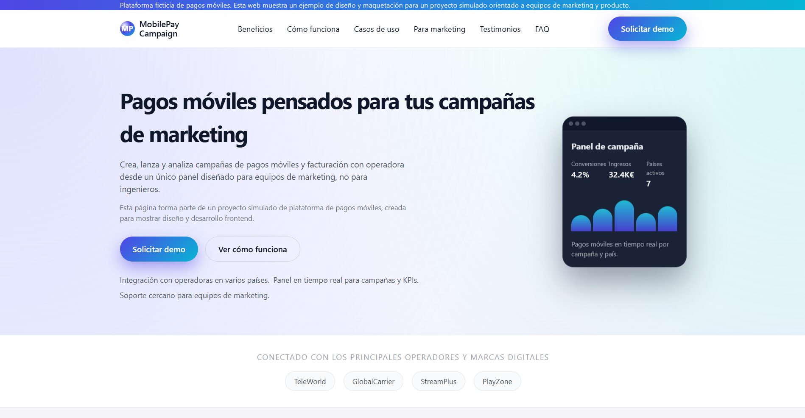

Te dejo el README completo ya corregido para que puedas pegarlo entero si quieres:

```markdown
# MobilePay Campaign – Landing de pagos móviles (proyecto simulado)



MobilePay Campaign es la landing de una plataforma ficticia de pagos móviles pensada para equipos de marketing y producto.  
La he creado como ejemplo de **diseño frontend moderno**, responsive y centrado en campañas digitales con operadores móviles.

> Proyecto simulado para mostrar mi forma de trabajar en HTML, CSS y JavaScript en un contexto cercano a soluciones de pagos móviles.

---

## Demo

Puedes ver la landing desplegada aquí:

https://ign4fer.github.io/mobilepay-campaign-landing/

---

## Sobre el proyecto

La idea es reproducir una landing que podría usar un departamento de marketing para presentar un producto de pagos móviles:

- Mensaje de valor claro desde el hero.
- Secciones diferenciadas para beneficios, funcionamiento, casos de uso y planes.
- Textos orientados a negocio (no solo “lorem ipsum”).
- Detalles de interacción que hacen la página más legible y agradable de usar.

El objetivo principal es demostrar maquetación cuidada, diseño responsive y pequeñas interacciones en JavaScript sin depender de frameworks.

---

## Stack y características

### Tecnologías

- **HTML5 semántico**
  - Estructura basada en `<header>`, `<main>`, `<section>`, `<nav>`, `<footer>`.
  - IDs y anclas internas para la navegación con scroll suave.

- **CSS3**
  - Maquetación con **Flexbox** y **CSS Grid**.
  - Sistema de **variables CSS** (`:root`) para colores, sombras y radios.
  - Enfoque **mobile-first** con media queries para tablet y escritorio.
  - Componentes reutilizables: tarjetas, botones, timeline de pasos, FAQ, etc.

- **JavaScript (ES6) vanilla**
  - Menú móvil (icono hamburguesa) con control de `aria-expanded`.
  - Scroll suave entre secciones.
  - FAQ desplegable (acordeón).
  - Contadores numéricos animados en el hero.
  - Aparición suave de bloques al hacer scroll (`IntersectionObserver`).
  - Resaltado automático de la sección activa en la navegación.

---

## Estructura de la página

Las secciones principales son:

1. **Top bar**  
   Mensaje corto de propuesta de valor y acceso rápido a “Solicitar demo”.

2. **Cabecera fija**  
   Logo, navegación y botón de demo (visible solo en escritorio).

3. **Hero**  
   Titular, subtítulo, llamadas a la acción y tarjeta visual con métricas animadas de campaña.  
   Incluye un aviso de que se trata de un proyecto simulado.

4. **Franja de confianza**  
   Operadores y marcas ficticias para simular social proof.

5. **Beneficios**  
   Grid de tarjetas con ventajas para negocio y marketing.

6. **Cómo funciona**  
   Tres pasos presentados como **timeline vertical en móvil** y como cards en escritorio.

7. **Casos de uso**  
   Seis escenarios típicos (SMS, suscripciones, recargas, donaciones, alertas, votaciones) con botón “Ver ejemplo”.

8. **Pensado para marketing**  
   Copia dirigida a equipos de marketing y vista previa de un pequeño dashboard.

9. **Planes**  
   Tres planes (Starter, Growth, Enterprise) con un plan central destacado.

10. **Testimonios**  
    Opiniones ficticias pero coherentes con el tipo de producto.

11. **Preguntas frecuentes (FAQ)**  
    Acordeón con dudas habituales sobre integración, países, seguridad, tiempos y soporte.

12. **Contacto / CTA final**  
    Texto y formulario para “solicitar demo”.

13. **Footer**  
    Recordatorio de que es un proyecto simulado y enlaces de producto / legal / redes.

---

## Cómo ejecutar el proyecto

No requiere dependencias ni build. Es un proyecto estático.

```bash
# Clonar el repositorio
git clone https://github.com/ign4fer/mobilepay-campaign-landing.git
cd mobilepay-campaign-landing

# Abrir index.html en el navegador
# (doble clic o usando un servidor estático tipo Live Server de VS Code)
